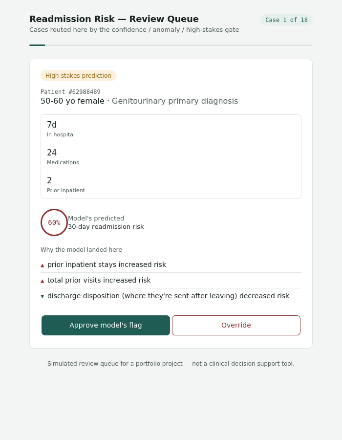

# Interpretable Patient Risk System

**Explainable 30-day hospital readmission risk, with a human in the loop.**

A readmission risk system built on the UCI "Diabetes 130-US Hospitals"
dataset. It doesn't just predict risk — it flags patients whose overall
profile looks statistically unusual, explains every prediction in plain
language, and routes uncertain or high-stakes cases to a human reviewer
instead of acting alone.

**At a glance:** Random Forest, 0.641 AUROC (in line with published
results on this dataset) · Isolation Forest flags ~2% of patients, who
turn out to have ~2x the readmission rate · SHAP explains every
prediction · 19% of patients get routed to human review · every review
decision is logged.


*The review interface a clinician would use — risk score, plain-English
reasons, and an approve/override decision, for every case the gate
flags.*

## Architecture

```
Raw UCI data (101,766 encounters)
        │
        ▼
[data_pipeline.py]          dedupe to 1 encounter/patient, drop
                             unusable/leaky columns, ICD-9 grouping,
                             70/15/15 stratified split
        │
        ▼
[anomaly_detection.py]      Isolation Forest, trained on "normal" train
                             patients only → anomaly_score + is_anomaly
                             on every row
        │
        ▼
[train_baseline.py]         Logistic Regression baseline + Random Forest
                             (kept model), class_weight="balanced"
        │
        ▼
[explainability.py]         SHAP TreeExplainer → per-patient reasons +
                             global feature importance
        │
        ▼
[generate_review_queue.py]  Gate: |risk-0.5| in bottom 10% (uncertain) OR
                             anomaly flagged OR risk in top 8% (high-stakes)
                             → builds a review queue with plain-English
                             SHAP reasons attached
        │
        ▼
[app/human_review_ui.html]  Clinician reviews each gated case (risk +
                             top reasons + anomaly flag), approves or
                             overrides, decisions logged and exportable
```

## Results

| Model | Val AUROC |
|---|---|
| Logistic Regression (baseline) | ~0.63 |
| Random Forest (kept) | **0.641** |

This is in line with published results on this exact dataset (Strack et
al. report ~0.65). 30-day readmission is genuinely hard to predict from
hospital records alone — a lot of what actually drives it (home support,
medication affordability, follow-up access) simply isn't captured in an
EHR extract.

At the default 0.5 threshold, the Random Forest catches **~53% of true
readmissions** (recall) at **~13% precision** — about 1 correct flag per
7 false alarms. In a screening context that's a defensible trade-off
(missing a real at-risk patient is costlier than one extra follow-up
call), but it's a trade-off, not a free win, and it's exactly why this
system routes uncertain cases to a human rather than auto-acting.

**19% of validation patients (1,995 of 10,496) hit the review gate** —
low enough to be a realistic clinician workload, high enough to catch the
cases that matter.

## Responsible AI reflection

**The model is calibrated to be unsure, and that's not a flaw to hide.**
With a 0.64 AUROC, predicted risk scores cluster tightly between roughly
0.42 and 0.60 — the model rarely commits to a confident answer in either
direction. My first pass at the human-in-the-loop gate used threshold
values that sounded reasonable in isolation (flag anything 0.40–0.60 as
"uncertain," anything ≥0.70 as "high-stakes") and it gated **85% of
patients** — which defeats the entire point of a gate. The fix was to
calibrate against the model's actual output distribution (percentiles),
not against intuition about what a probability "should" look like. I'm
keeping this in the writeup rather than quietly fixing it, because it's
a realistic failure mode: thresholds that look sensible on paper can be
silently wrong for a specific model, and the only way to catch that is
to look at the real distribution before trusting a cutoff.

**Class imbalance is handled with a cost, and that cost is visible.**
`class_weight="balanced"` was necessary to get the model to predict
"readmit" at all (readmission is ~9% of the population), but it shifts
what the model's own outputs mean — the SHAP "base rate" landed at 0.500
rather than the true 8.97% population rate, because the trees were
trained on reweighted data. Anyone building on this model needs to know
its raw probability outputs aren't population-calibrated probabilities;
they're risk *rankings*.

**The anomaly layer earns its place by disagreeing usefully, not by
being redundant.** It was trained with zero access to the readmission
label, purely on utilization patterns (medications, length of stay,
prior visits). Flagged patients turned out to have roughly **double the
readmission rate** of everyone else (16–18% vs ~9%) — an independent
signal that happened to correlate with real risk, which is the strongest
argument that it's catching something real rather than noise. It also
flags a few cases the risk model itself is only moderately confident
about, which is exactly the disagreement a human-in-the-loop layer
should surface.

**What I'd do with more time / real deployment constraints:**
- Calibration curve, not just AUROC — a "confident wrong answer" is
  more dangerous than a low-confidence one in this setting.
- A held-out fairness audit across race/age/gender subgroups — this
  dataset has known historical biases in how race was recorded, and I
  haven't checked whether the model's errors are evenly distributed.
- Real retraining loop using the logged clinician overrides, rather
  than just exporting them as CSV.
- MIMIC-III/IV or a live EHR feed instead of a static 2014-era public
  dataset, if this were ever meant for anything beyond a portfolio piece.

## Project structure

```
interpretable-patient-risk-system/
├── data/
│   ├── raw/              # not committed -- see "Getting the data" below
│   └── processed/        # not committed -- regenerated by data_pipeline.py
├── src/
│   ├── data_pipeline.py          # Module 1
│   ├── train_baseline.py         # Module 2
│   ├── anomaly_detection.py      # Module 3
│   ├── explainability.py         # Module 4
│   ├── generate_review_queue.py  # Module 5 data prep
│   └── generate_synthetic_data.py # optional -- lets you test the pipeline
│                                    shape without downloading the real data
├── app/
│   └── human_review_ui.html      # Module 5 UI -- open directly in a browser
├── models/
│   └── rf_model.pkl              # not committed -- regenerated by train_baseline.py
├── outputs/
│   ├── global_feature_importance.csv
│   └── review_queue.json
├── docs/                 # personal dev notes, not part of the pitch
└── requirements.txt
```

## Getting the data

Download the "Diabetes 130-US Hospitals for Years 1999-2008" dataset
(UCI ML Repository, dataset 296) and place `diabetic_data.csv` and
`IDS_mapping.csv` into `data/raw/`.

## Running it

```bash
pip install -r requirements.txt

python src/data_pipeline.py          # Module 1: clean + split
python src/anomaly_detection.py      # Module 3: flag outlier patients
python src/train_baseline.py         # Module 2: train + save model
python src/explainability.py         # Module 4: SHAP explanations
python src/generate_review_queue.py  # Module 5: build the review queue

open app/human_review_ui.html        # Module 5: review the gated cases
```

Note the run order above (pipeline → anomaly → baseline → explainability
→ queue) — `train_baseline.py` and `explainability.py` don't strictly
need the anomaly columns, but `generate_review_queue.py` does, so
`anomaly_detection.py` has to run before it.

## Dataset citation

Strack, B., DeShazo, J.P., Gennings, C., et al. (2014). "Impact of HbA1c
Measurement on Hospital Readmission Rates: Analysis of 70,000 Clinical
Database Patient Records." *BioMed Research International*. Dataset via
UCI Machine Learning Repository.
